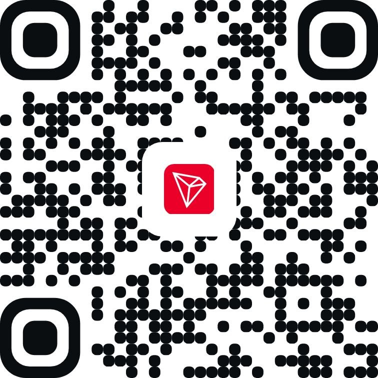
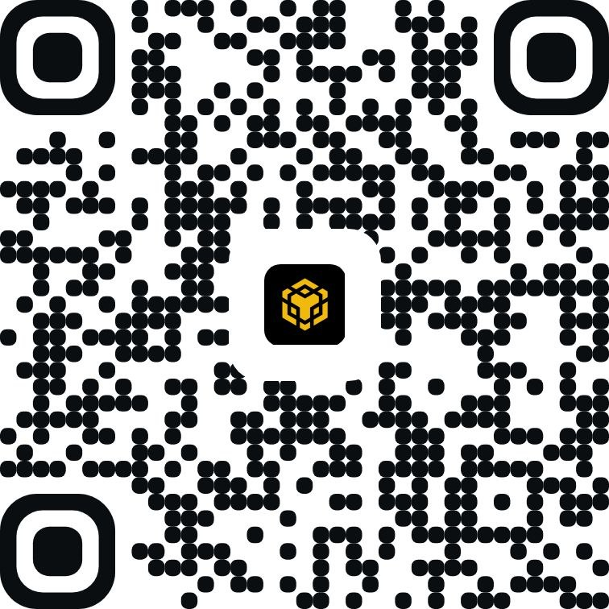
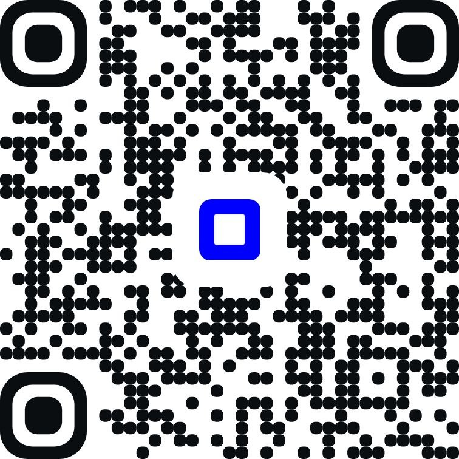
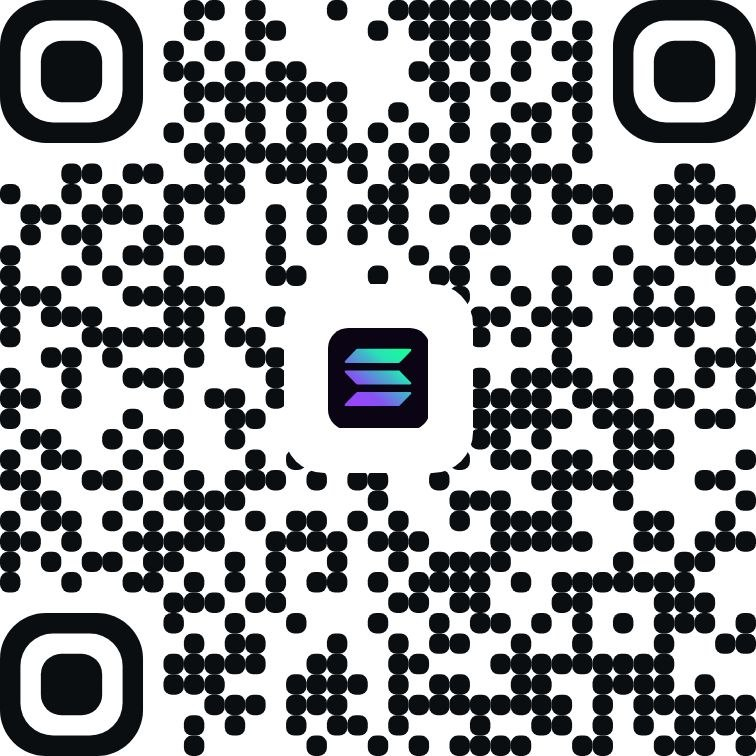

# ❤️ Support

Support is optional. If something I've built has been useful to you, you can support my work through the options below.

## ⚡ Exchange transfers

### Binance Pay

ID: `164210440`

### Bybit

Internal transfer / UID: `258922520`

## 💵 Stablecoins

Send each token using the exact network shown.

### USDT — TRON (TRC-20)

Address: `TXAVS1cH35HaKywYz4D84GmhNcieE5Sb6Q`

### USDT — BNB Smart Chain (BEP-20)

Address: `0xfA4b5E521D39294908c7a26B08e668D556d9238c`

### USDC — Base

Address: `0xfA4b5E521D39294908c7a26B08e668D556d9238c`

### USDC — Solana

Address: `BD1CxcTNuit1RE8ztaHcNp95T5B32pKDVdAJ84d87WdB`

## 🔗 Other accepted EVM networks

The same EVM wallet address is used across these supported networks:

`0xfA4b5E521D39294908c7a26B08e668D556d9238c`

- Ethereum
- BNB Smart Chain
- Base
- Arbitrum One
- Optimism
- Polygon PoS
- Avalanche C-Chain

## ⚠️ Before sending

- Verify the asset and network before sending.
- Cryptocurrency transfers are irreversible.
- On EVM chains, the same `0x...` address does not mean that any network is interchangeable.

[Back to profile →](README.md)
